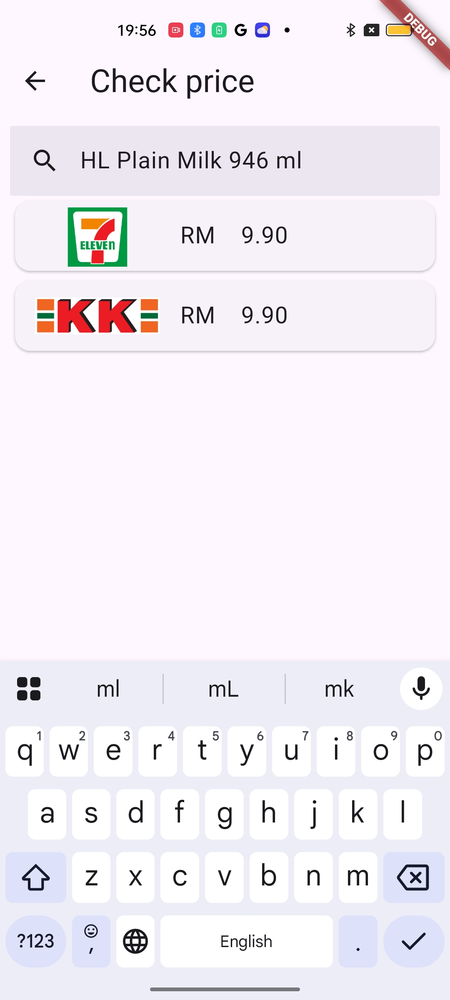

# Goodsprice
#### Video Demo:  https://www.youtube.com/watch?v=N4mdkMo1_FI
#### Description:
Goodsprice is a mobile application designed to help users track and compare the prices of everyday items across different convenience stores. 

#### Problem to solve:
Have you every bought something from a convenience store, only to discover later that the same item was available for a lower price elsewhere? This common frustration can lead to unnescessary spending and buyer's remorse. With prices varying from store to store, it’s difficult to know if you're getting the best deal—especially when you're in a rush or unfamiliar with local pricing trends.

Goodsprice solves this problem by empowering users to:
- Record and compare item prices across multiple stores.
- Make smarter purchasing decisions based on real data.
- Save cents or even dollars on everyday products you buy. A compounding effect.

#### App features:
1. Store selector
    - A list view of supported convenience stores. Due to the difference in the shapes of price tags, the selected store changes the guide box in scanner page.

2. Camera scanner
    - A live camera feed with a guide box (green) to scan price tag of items. Once the price tag is captured, it will navigate to the results page.

3. Scan results page
    - A landing page to show the results of the extracted text on the price tag. The scanner captures the **item name** and **price**, and displays it in a table.
    - Because the scanned results are highly dependant on the condition of the price tag, there may be errors in the extracted text. With this, users are allowed to edit the item name and price, before submitting the data to the database.

4. Price checker page
    - A page to check the item prices you have previously scanned. Users can search for the item name, or click on the suggestions to check the item's price.
    - A list view of prices, with the icon of the store will be shown.
    

#### Scanning feature
1. Capturing the image
    - The feature utilizes the flutter `camera` package to take a picture and store in app's cache.

2. Cropping the image
    - To obtain the Region Of Interest (ROI), it crops the image to the size of the guide box shown on the scanner.
    - Cropping is necessary to filter out unnecessary text captured in the image.

3. Extracting item name
    - The algorithm includes:
        - `opencv`: To obtain the outermost bounding box of the price tag. (Green bounding box)
            - 
        - `Google ML Kit Text Recognition`: To recognize and extract text from images. (Red bounding boxes)
            - 
        - Combination of both:
            - 
    - Due to vagueness of item names, the item names can be obtained by checking the position of the text in the price tag.
        - For example : In 7-11, the item name is determined by checking if the detected text falls within the top 20% of the outermost bounding box of the price tag.

4. Extracting price
    - The price is extracted using regular expressions.
    - However, this can be further improved later on.

#### How data is stored
- The use of flutter `sqflite` package allows the application to create and store a database in the application's default database directory.
`/data/data/com.example.goodsprice/databases/goodsprice.db`
- The relationship between `item names` and `stores` are a many-to-many relationship. Because of this, three tables are created:

    - #### StoreNames
    | store_id | store_name |
    |:--------:|:----------:|
    |     0    |     ...    |
    |    ...   |     ...    |

    - #### ItemNames
    | item_id | item_name |
    |:-------:|:---------:|
    |    0    |    ...    |
    |   ...   |    ...    |

    - #### Price
    | item_id | store_id | price |
    |:-------:|:--------:|:-----:|
    |    0    |    ...   |  ...  |
    |    1    |    ...   |  ...  |

#### Fuzzy Logic
- Each store has different naming conventions for item names. Therefore, the exact same item could be listed under different names depending on the store.
- To prevent storing duplicate entries for the same item under different names, flutter `fuzzywuzzy` package is used to detect the similaries with the previously stored item names.

## Images

### Home Page

### Store Selector Page

### Camera Scanner Page

### Scan Results Page

### Price Checker Page

## TODO:
- [ ] Finish the branch "classes"
- [ ] Remove Camera.dart, individual models (7eleven.dart , kk.dart)
- [ ] Add guard rails when editing price.

